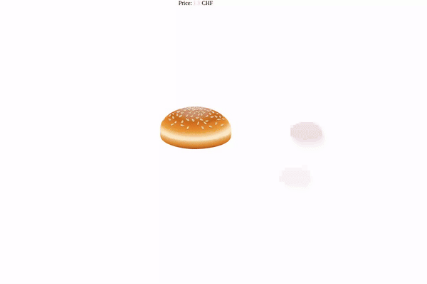
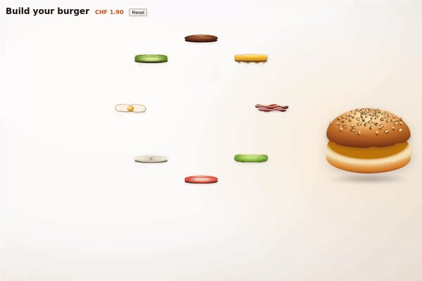

Cleaning my old drive, I found `burger.zip` dated 2015. Inside: one of my first paid web gigs, a burger builder for a Swiss client. 
Radial menu of ingredients, click one, it flies onto a bun, price ticks up in CHF. jQuery 1.7. I had to give it a second life.

| Before (2015, jQuery) | After (2026, TS + GSAP) |
| --- | --- |
|  |  |

## What Happened

The original was 1244 lines across five files. jQuery, a 780-line `radmenu` plugin, hardcoded math, and this stack-height fix:

```js
switch(i){
  case 0: hhh+=20; break;
  case 1: hhh+=5; break;
  case 2: hhh-=25; break;
  case 3: hhh-=20; break;
  case 4: hhh-=15; break;
  case 5: hhh-=12; break;
}
$('#burger_wrap').height($('#burger_wrap').height()+l*12+hhh);
```

Yes. Past me solved stack height with a hardcoded switch.

The code still worked. Three CDN scripts loaded over `http://`, which modern browsers now block. 
One `s` made it bootable again. I committed that fix as `legacy/`, untouched otherwise.

## Investigation

Then I rebuilt it next door at `modern/`. Vite for the build, TypeScript for safety, GSAP for the fly animation. Same UX: ingredients orbit the center, click flies them onto the bun, click in the stack removes them.

The radial picker took 50 lines of trig instead of a 780-line jQuery plugin:

```ts
const cx = container.clientWidth / 2;
const cy = container.clientHeight / 2;
const radius = Math.min(cx, cy) - 40;
const step = (Math.PI * 2) / els.length;

els.forEach((el, i) => {
  const a = offset + i * step - Math.PI / 2;
  const x = cx + Math.cos(a) * radius;
  const y = cy + Math.sin(a) * radius;
  el.style.transform = `translate(${x}px, ${y}px)`;
});
```

The stack-height switch became flex column with negative margin:

```css
#stack { display: flex; flex-direction: column; }
#stack li { margin-top: -44px; }
```

## Making It Feel Real

The first rebuild worked, but it felt flat. I ran three parallel agents: one on bun art, one on ingredients, one on motion. 
Result: gradients and sesame seeds on the buns, grill marks on the beef, drip teardrops on the cheese. 
Plus a quarter-turn tumble with motion blur on each fly-in, a squash on landing, and a slow idle jiggle once the stack hits three items. 
CSS `perspective` + `rotateX(8deg)` tilts the burger toward the viewer.

Two things bit me.

**GSAP overwrites CSS transforms.** I centered the burger with `transform: translateY(-50%)`. The first `gsap.to(burgerEl, { y: 3 })` stomped that translate and the burger drifted off the page. 
Fix: center without `transform`.

```css
#burger {
  position: fixed;
  top: 0; bottom: 0;
  margin: auto 0;
  height: max-content;
}
```

**Agents can polish away meaning.** My bun-art agent rewrote `down.svg` with cleaner gradients and richer seeds. 
It looked sharper. Flat. The original encoded a side-cut profile: dark crust on top, cream crumb in the middle, brown base. The rewrite lost it. 
I reverted to the legacy SVG verbatim and kept the new top bun. The legacy SVG encoded something the polish lost, and no diff would have told me.

## TL;DR

- Archived the 2015 original verbatim under `legacy/`, rebuilt next door in TypeScript + GSAP
- 780-line `jQuery.radmenu` plugin replaced with ~50 lines of trig
- Three parallel agents added bun gradients, ingredient detail, tumble + squash + idle jiggle
- GSAP `y` tweens overwrite CSS `transform: translateY(-50%)` — center without `transform`
- AI polish stripped the side-cut anatomy from the bottom-bun SVG; reverted to the 2015 hand-drawn art

👉 https://github.com/tegos/burger-reborn

## Author's Note

Thanks for sticking around!
Find me on [dev.to](https://dev.to/tegos), [linkedin](https://www.linkedin.com/in/ivan-mykhavko/), or you can check out my work on [github](https://github.com/tegos).

**Laravel, after the happy path.**
